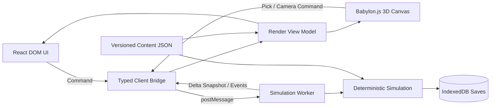

# 《龙之崛起》精神续作：网页版技术选型

> 日期：2026-07-10  
> 目标：桌面浏览器优先的中重度风格化 3D 城市模拟；正交/弱透视沙盘相机；单机 MVP，架构允许后续云存档、UGC 与多人协作。  
> 结论：采用 **TypeScript 原生 Web 栈 + Babylon.js + React + Web Worker**，不采用 Unity/Godot Web 导出。默认 WebGL2，WebGPU 作为增强/实验路径。

## 1. 最终选型

| 层 | 选择 | 用途 |
| --- | --- | --- |
| 语言 | TypeScript（strict） | 客户端、模拟、工具和未来 Node 服务统一语言 |
| 构建 | Vite + pnpm workspaces | 开发、Worker 打包、资源拆包、多个内部 package |
| 地图渲染 | Babylon.js，生产默认 WebGL2 | 3D 地形、建筑、行人、天气、覆盖层、拾取和相机 |
| 游戏 UI | React + DOM/CSS | 面板、报表、菜单、教程、可访问性和文本输入 |
| UI 状态 | Zustand（仅 UI/会话状态） | 面板开关、选中对象、设置；不保存模拟真相 |
| 模拟 | 独立 Dedicated Web Worker | 固定 tick 的人口、生产、物流、服务、财政等 |
| 数据交换 | typed message protocol + transferable buffers | 主线程与 Worker 之间传命令、增量快照和事件 |
| 内容定义 | JSON + Zod schema + 版本号 | 建筑、配方、需求、事件、任务、时代、地图元数据 |
| 本地存档 | IndexedDB + Dexie | 多存档、自动存档、缩略图、schema migration |
| 地图制作 | 自研游戏内编辑器；高度图/JSON 为底层格式 | 3D 地形、水系、道路、资源、区域和任务触发器 |
| 美术管线 | Blender → glTF/GLB；KTX2 纹理；PS 等制作 UI | 模块化建筑、LOD、动画、材质、UI 图标 |
| 音频 | Web Audio API；Howler.js 作为薄封装（可选） | 环境声、音乐、短音效、音量分组 |
| 单元测试 | Vitest | 规则、配方、存档迁移、确定性与算法 |
| 浏览器测试 | Playwright | 操作流程、存档、加载、兼容性与性能冒烟 |
| 监控 | Sentry（上线后）+ 自研性能 HUD | 异常、卡顿、tick、实体数、draw call、内存趋势 |
| 部署 | 静态对象存储/CDN；HTTPS | MVP 无后台即可发布，资源可长期缓存 |
| 后台（后置） | Node.js + Fastify + PostgreSQL + 对象存储 | 账号、云存档、UGC 元数据、排行榜 |
| 多人（后置） | Colyseus，服务端权威 | 房间、匹配、增量状态同步；只在多人立项后引入 |

## 2. 为什么是 Babylon.js，而不是 Three.js / Unity / Godot

### 推荐：Babylon.js

Babylon.js 是面向浏览器的完整 3D 引擎，提供相机、材质、拾取、实例化、LOD、glTF、调试器以及 WebGL/WebGPU 双路径。对于 3D 城市模拟，它比从 Three.js 的渲染层自行拼装整套游戏设施更适合快速形成稳定生产管线。

Babylon.js 同时维护 WebGL 与 WebGPU。项目策略是：

- 默认 WebGL2，保证正式支持的浏览器都能运行。
- 开发环境提供 WebGPU 开关，用同一场景持续验证；不能让游戏功能依赖 WebGPU。
- 不把上线能力绑定到 WebGPU、SharedArrayBuffer 或 OffscreenCanvas。

官方依据：[Babylon.js WebGPU 支持](https://doc.babylonjs.com/setup/support/webGPU/)、[实例化系统](https://doc.babylonjs.com/features/featuresDeepDive/mesh/copies/instances/)。

### 不选 Three.js 作为主引擎

Three.js 是优秀的 3D 渲染库，并提供 InstancedMesh 等基础能力；但相机交互、资源生命周期、LOD、编辑器工具、调试与游戏级设施需要项目自行组合。本项目的差异化在城市模拟，不在自研 3D 引擎外壳，因此选 Babylon.js 降低渲染基础设施成本。

如果团队已有很强的 Three.js 生产经验，可用同一压力场景对照；无既有包袱时不优先选择 React Three Fiber，避免让数千动态对象进入 React 逐帧更新路径。

### 不选 Unity Web

Unity 适合“桌面/移动优先，Web 是附加平台”的跨平台项目，但本项目明确是网页版。Unity Web 会带来更重的初始下载、DOM UI/网页集成成本、调试与平台约束，并降低内容按需加载和网页工具复用的灵活性。Unity 官方也列出 Web 平台在线程、网络、调试、缓存和音频方面的限制：[Unity Web 技术限制](https://docs.unity3d.com/cn/current/Manual/webgl-technical-overview.html)。

### 不选 Godot Web

Godot 能快速制作独立游戏，但 Web 导出在多线程模式下需要跨源隔离响应头；官方当前默认推荐兼容性更好的单线程导出，而城市模拟恰恰需要把重计算从主线程移出。[Godot Web 导出说明](https://docs.godotengine.org/en/stable/tutorials/export/exporting_for_web.html)。除非未来“原生客户端优先、Web 只是试玩版”，否则不作为首选。

## 3. 总体架构



### 三条不可破坏的边界

1. **模拟是唯一真相源**：钱、库存、居民、建筑状态、任务进度都在 Worker 内。React/Zustand 不得复制一套可写的游戏状态。
2. **渲染不是模拟**：画面中的行人可以插值、裁剪、降帧或简化，不能决定货物是否送达。
3. **玩家操作是命令**：建造、拆除、改路线、调税率都是带序号的 command；模拟验证后返回 accepted/rejected 和原因。

## 4. 模拟线程方案

### 4.1 Worker 划分

MVP 使用一个 Dedicated Web Worker 承担全部模拟。Web Worker 能在独立线程执行重计算，避免阻塞 DOM/UI 主线程；IndexedDB 等 API 也能在 Worker 中使用。[MDN Web Workers](https://developer.mozilla.org/en-US/docs/Web/API/Web_Workers_API)、[Worker 可用 API](https://developer.mozilla.org/en-US/docs/Web/API/Web_Workers_API/Functions_and_classes_available_to_workers)。

- 主线程：输入、React、Babylon.js、相机、音频、视觉插值。
- 模拟 Worker：固定步长、世界状态、寻路任务、物流、规则、事件、序列化。
- 不在 MVP 拆多个 Worker。跨 Worker 调度和共享内存会先增加复杂度；压力测试证明单 Worker 不够后，再把地图生成或批量寻路拆出。

### 4.2 时间模型

- 固定模拟频率建议从 **10 tick/s** 开始；城市经济的低频系统按不同 cadence 执行，例如物流 10 Hz、服务 2 Hz、财政 1 Hz、月度规则按游戏时间触发。
- 视觉层按 `requestAnimationFrame` 渲染，使用前后快照插值。
- 暂停只停止模拟 tick，不停止相机和 UI。
- 快进不是增大 `deltaTime`，而是在预算内一次执行多个固定 tick；超过帧预算自动降速并提示。

### 4.3 数据组织

不建议一开始引入通用 ECS 框架。城市模拟有大量领域关系：住宅—家庭—岗位—库存—配送合同—服务覆盖。优先使用：

- 稳定的整数实体 ID。
- 热路径用 TypedArray / struct-of-arrays。
- 复杂低频数据用 Map/普通对象。
- 以领域系统组织：`housingSystem`、`laborSystem`、`productionSystem`、`logisticsSystem`、`serviceSystem`。
- 每个系统只通过显式 command/event 或 world API 修改状态。

通用 ECS 只有在压测显示实体遍历和组合查询成为主要成本时再评估；不要为了“架构先进”牺牲领域可读性。

### 4.4 TypeScript 与 WASM

首版全部使用 TypeScript。先用 Chrome/Firefox profiler 找真实热点，再决定是否将以下纯计算模块改为 Rust/WASM：批量寻路、洪水/水文、地图生成、压缩。不要把整个模拟提前搬进 WASM，否则调试、数据交换、热更新与内容工具都会变难。

## 5. 地图、渲染与性能

### 5.1 等距坐标

世界状态全部使用整数 tile 坐标，不使用 3D 浮点坐标作为规则依据。渲染层负责转换：

```text
worldX = tileX * cellSize
worldZ = tileY * cellSize
worldY = elevation * heightStep
```

建筑 footprint、寻路、地块所有权都以 tile 为准；模型锚点、朝向、地基高度和选择轮廓放在表现元数据里。相机默认使用正交投影、45° 左右方位角和受限俯仰，允许 90° 分段旋转与平滑缩放；自由透视相机仅用于开发观察。

### 5.2 分块与绘制

- 地图按 16×16 或 32×32 tile 分 chunk；地形使用 chunk mesh，修改高度/水系时只重建脏 chunk。
- 树、作物、围墙、道路构件和同型住宅使用 instance/thin instance；需要独立拾取和状态的建筑使用普通 instance 或聚合代理。
- 屏外 chunk 不提交绘制；远景行人降低动画频率或改用简化模型/广告牌。
- 模型使用 glTF/GLB，限制材质数量；纹理走 KTX2/压缩纹理并提供兼容回退。
- 覆盖层（供水、吸引力、风水、污染）使用地形 shader、投影纹理或 chunk mesh，不为每格创建独立网格。
- 太阳阴影只覆盖相机附近，低配关闭动态阴影；建筑环境遮蔽优先烘焙，水面和天气效果设严格性能档位。

### 5.3 第一阶段性能预算

| 指标 | 建议验收线 |
| --- | --- |
| 桌面目标 | 1920×1080，60 FPS；模拟快进可降低视觉帧率 |
| 可见动态单位 | 1,000 个 3D 单位仍可交互，3,000 个简化单位压力测试 |
| 世界居民 | 不要求每名居民都有永久渲染对象；目标 50,000+ 抽象人口 |
| 地图 | MVP 160×160；架构验证 512×512 |
| 主线程帧预算 | P95 < 12 ms，留浏览器/UI 余量 |
| 模拟 Worker | 正常速度 P95 < 30% 单核预算；快进不得积压无上限消息 |
| Worker 消息 | 正常帧不传完整世界；只传增量和可见区数据 |
| 首次可操作 | 中档网络冷启动目标 < 8 秒，回访 < 3 秒 |

## 6. 寻路、服务和物流

不购买一套“全实体每帧 A*”的技术债。分成三种问题：

1. **服务覆盖**：从服务建筑生成受道路与策略约束的距离场；道路变化时按 chunk 增量失效，不为每栋住宅重复寻路。
2. **物流派单**：先用库存预留和成本函数选取起终点，再为实际运输单位求路。成本包括距离、道路等级、拥堵和优先级。
3. **可见行走**：单位沿缓存路径移动；路径失效时进入重新规划队列，设每 tick 预算，避免拆一条路造成尖峰。

早期实现网格 A* + 路径缓存 + 连通域；地图和道路规模上来后再加分层寻路（HPA*）、方向场或道路图压缩。所有路径请求必须可在调试层显示起点、终点、成本、缓存命中和失败原因。

## 7. UI 与状态管理

React 只做 DOM UI；不要用 React 逐帧管理 Babylon scene node。React 官方定位本身就是组件化 UI，适合复杂面板与 TypeScript 集成：[React UI](https://react.dev/learn/describing-the-ui)、[React + TypeScript](https://react.dev/learn/typescript)。

- 高频数据（单位位置、粒子、动画）直接进入 Babylon render view model。
- 低频数据（国库、人口、选中建筑详情、任务）按订阅主题推给 React。
- Zustand 仅管理相机模式、工具状态、面板布局、偏好设置和当前选择。
- 图表使用 SVG/Canvas 的轻量自研组件；没有确定需求前不引入大型图表库。
- UI 从第一天支持 100%/125%/150% 缩放、键盘导航、色盲覆盖层与简体中文文本扩展。

## 8. 存档与内容数据

### 8.1 存档

IndexedDB 适合保存大量结构化数据和 Blob，也可在 Worker 中访问；Dexie 简化事务、查询和 schema migration。[MDN IndexedDB](https://developer.mozilla.org/en-US/docs/Web/API/IndexedDB_API)、[Dexie 文档](https://dexie.org/docs)。

每个存档包含：

- `saveFormatVersion`、`gameBuild`、`contentPackVersions`。
- 世界快照、随机种子、当前 tick、任务状态。
- 最近若干 command/event（用于诊断，不要求无限事件溯源）。
- 缩略图、玩家备注、游玩时长和校验值。

自动存档采用轮换槽；写入新记录成功后再更新“最新存档”指针，避免崩溃破坏唯一存档。提供导出/导入压缩文件，使用户不依赖浏览器站点数据。

### 8.2 内容

建筑、资源、配方、需求、时代、事件和任务均使用版本化 JSON；启动/CI 使用 Zod 校验。逻辑代码只实现可组合的规则原语，内容包组合原语：

```text
packages/content-schema     schema、ID 规则、迁移
content/base                基础建筑、资源、配方
content/campaign-xia        地图、事件、任务、文本
content/dev                 压测图和调试建筑
```

所有 ID 永久稳定；显示名称走本地化 key；平衡数值不得散落在 React 或渲染代码中。

## 9. 仓库结构

```text
apps/
  game-web/                 Vite + React + Babylon.js 入口
  content-editor/           后续地图/事件/数值编辑器
packages/
  simulation/               无 DOM、无 Babylon、可在 Node/Vitest 运行
  protocol/                 command、snapshot、event 类型与编解码
  renderer/                 Babylon 场景、chunk、实例、相机、动画、拾取
  game-ui/                  React 面板和设计系统
  content-schema/           Zod schema、版本迁移、ID
  persistence/              IndexedDB/Dexie、导入导出
  test-fixtures/            固定种子、基准地图、黄金快照
content/
  base/
  campaigns/
tools/
  blender-export/
  asset-validation/
  content-validation/
```

使用 pnpm workspace 即可；MVP 不引入 Nx/Turborepo。只有在 CI 构建缓存明显成为瓶颈后再加任务编排工具。

## 10. 开发前必须完成的技术试验

用 2 周制作“技术切片”，不是玩法 Demo：

### 场景

- 512×512 3D tile 地图，随机地形、高度、水面和正交沙盘相机。
- 10,000 个实例化建筑/植被占位，3,000 个可见简化动画单位。
- Worker 内 50,000 抽象居民、2,000 物流任务、道路反复拆建。
- React 同时展示选中详情、人口/库存曲线和四个覆盖层。
- 10× 快进运行 10 分钟，自动存档并加载校验。

### 通过条件

- Chrome、Edge、Firefox、Safari 当前稳定版实测，无功能分叉。
- WebGL 默认路径达到第 5 节预算；WebGPU 只记录结果，不作为门槛。
- 主线程操作没有由模拟造成的长任务；拆路不造成不可控寻路尖峰。
- 保存—刷新—读取后世界 checksum 一致。
- 同种子、同 command 序列在浏览器与 Node 测试中得到相同关键状态。

若 Babylon.js 未达标，先检查模型、材质、阴影、实例化和 chunk 策略；确认是引擎瓶颈后，再用完全相同的世界快照做 Three.js 对照，不在不同测试内容下凭手感换引擎。

## 11. 测试与 CI

- 规则测试：每条生产链、住房升级、税率、疾病、服务覆盖都有表驱动用例。
- 确定性测试：固定种子 + command 日志 → 定期 world checksum。
- 黄金存档：每次 schema 修改都必须能迁移最近两个公开版本。
- 模糊测试：随机建造/拆除/改政策，运行数万 tick，断言库存非负、引用有效、队列有界。
- 浏览器 E2E：新游戏、建造、暂停/快进、保存、刷新加载、失败提示。
- 性能回归：固定压测图记录 tick P50/P95、路径请求、内存、draw call、启动时间；超过阈值阻止合并。
- CI 命令至少包括 `tsc --noEmit`、lint、Vitest、内容校验、构建和 Playwright 冒烟。Vite 只转译 TypeScript，不替代类型检查，官方也建议生产构建额外运行 `tsc --noEmit`。[Vite 功能说明](https://vite.dev/guide/features.html)

## 12. 后台与多人演进

### MVP

完全静态部署。存档在本地 IndexedDB，用户可导入/导出；这样最早的可玩版本无需账号、数据库和持续服务器成本。

### 云存档/UGC

引入 Fastify API、PostgreSQL 和 S3 兼容对象存储。数据库保存用户、存档元数据、内容包版本和权限；大型存档/地图文件进对象存储。客户端本地优先，用 revision + checksum 处理冲突，不做逐字段 CRDT。

### 多人

多人确认立项后再引入 Colyseus。它提供服务端权威房间、匹配和 schema 增量同步；服务端负责修改状态，客户端请求变更并接收 patch。[Colyseus 官方介绍](https://docs.colyseus.io/)、[状态同步](https://docs.colyseus.io/state)。

城市模拟的多人首选“同一区域的异步/低频合作”，不要一开始同步每个居民和行人。同步玩家命令、公共区域状态和关键聚合量；视觉单位由各客户端从权威状态重建。

## 13. 暂不采用的技术

| 技术 | 当前决定 | 重新评估条件 |
| --- | --- | --- |
| WebGPU-only | 不采用 | 主流目标浏览器稳定一致且实际压测收益显著 |
| OffscreenCanvas 渲染 | 不采用，模拟 Worker 已足够 | 主线程渲染持续成为瓶颈，且 Safari/输入/字体路径验证通过 |
| SharedArrayBuffer | 不采用 | 消息复制成为主要瓶颈，并能接受跨源隔离部署约束 |
| Rust/WASM 全模拟 | 不采用 | TypeScript 热点无法通过算法/数据布局优化解决 |
| 通用 ECS | 不采用 | 组合查询占主要复杂度和性能成本 |
| Next.js/SSR | 不采用 | 出现需要 SEO/服务端页面的官网，可另建站点；游戏本体无 SSR 价值 |
| 微服务 | 不采用 | 后台单体出现明确独立扩缩容和团队边界 |
| PWA 强制离线 | 后置 | 核心加载、版本升级和存档迁移稳定后再加 |

## 14. 启动版本与浏览器策略

- 依赖锁定 major/minor，提交 lockfile；每月小版本升级、每季度大版本评估。
- 正式支持桌面 Chrome、Edge、Firefox、Safari 当前及前一个大版本。
- 移动端首版显示兼容性说明，可浏览官网/存档，不承诺完整建造体验。
- 低配模式关闭高分辨率阴影、天气滤镜和远景单位动画，但不改变模拟结果。
- 浏览器功能通过 capability detection 判断，不根据 user-agent 写核心分支。

## 15. 决策摘要

第一阶段不要先写服务器，也不要先做全套建筑。先搭出以下最小垂直架构：

```text
Vite + TypeScript
├── React DOM UI
├── Babylon.js WebGL2 3D 沙盘
├── Simulation Web Worker
├── typed command / snapshot protocol
├── IndexedDB/Dexie 存档
└── Vitest + Playwright + 固定压测场景
```

这套选择能以最低平台摩擦验证游戏真正的难点：大地图、可解释服务、物流、住房和快进模拟；以后可独立替换渲染器、把热点迁入 WASM、加后台或多人，而不推翻游戏规则层。
