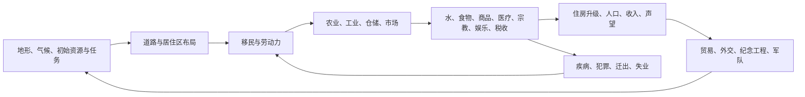

# 《皇帝：龙之崛起》重制：研究与设计基线

> 文档目的：将 2002 年《Emperor: Rise of the Middle Kingdom》（中文常称《皇帝：龙之崛起》，下称“原作”）拆解为可供新项目使用的设计基线。本文是研究、取舍与原创方向，不是原作说明书的替代品，也不应把原作的名称、美术、音频、文本、关卡、角色或数据直接用于新作。
>
> 研究日期：2026-07-10；首版范围：单机 PC 城市建造/历史策略。资料链接见文末。

## 0. 一页结论

原作是一款**实时、等距视角、以道路服务覆盖为核心的城市建造游戏**，不是《文明》式回合制 4X。玩家在古代中国的地图上，借由规划道路和居住区、组织食物及商品供应、处理卫生/治安/宗教/审美、进行贸易外交与有限战争，完成各关的城市目标。

它最值得继承的是“城市像一套可观察的活系统”：货物、官吏、商贩、祭司、疾病和军队都实际出现在道路上；住房把一串抽象指标转成可见的演变；地形、水源、气候与风水让布局有意义。它最不该原样继承的是：不可预测的步行者寻路迫使玩家造“路障谜题”、大量关卡从零重复开局、操作负担大而战略深度低的战斗，以及靠记得定期献礼驱动的琐碎事务。

建议的项目定位是：**“以中国古代城市生活为主角、以可解释物流和社会网络为核心的历史城市沙盘”**。第一版应把“建一个会运转、会讲故事的城”做深，战争只做为城市系统的压力与外交手段，而不做 RTS。

## 1. 原作事实档案

| 项目 | 结论 |
| --- | --- |
| 英文名 | *Emperor: Rise of the Middle Kingdom* |
| 中文常见名 | 《皇帝：龙之崛起》 |
| 开发/发行 | BreakAway Games、Impressions Games；Sierra Entertainment 发行 |
| 初版 | Windows PC，2002-09-09（不同地区日期可相差一天） |
| 类型 | 实时城市建造、资源管理、历史策略；等距 2D |
| 历史跨度 | 夏（约前 2100）至宋金及蒙古入侵前后（约 1211）；元朝不作为可玩朝代 |
| 内容模式 | 七个历史王朝战役、开放模式、局域网/直连多人、官方战役编辑器 |
| 系列位置 | Impressions City-Building 系列后期作品，承接《凯撒》《法老王》《宙斯》 |

原作的现代数字版仍可合法购得，GOG 页面列出手册和战役编辑器指南，并注明多人仅支持 LAN 或直连；这是研究原版时应优先使用的合法资料入口。[GOG 产品页](https://www.gog.com/en/game/emperor_rise_of_the_middle_kingdom)

## 2. 玩家体验：原作真正的核心循环



每一条链都应在画面上可见、在 UI 中可追因。玩家不是只摆建筑，而是在解决四类空间问题：

1. **覆盖**：住宅是否被水夫、市场商贩、巡检、医者、祭司等服务到。
2. **运输**：生产建筑、仓库、市场、贸易站相距是否合理；运输者能否及时返回。
3. **发展**：住房在需求满足与周边吸引力足够时升级，反之降级并引发人口/劳动力连锁反应。
4. **外部关系**：本地缺失资源、出口利润、盟友、贡赋、间谍与战争，使城市不成为孤岛。

## 3. 原作机制拆解

### 3.1 地图、地形与气候

- 地图由等距 tile 组成；河流、池塘、海岸、岩矿、树木、可耕地、坡地与帝国道路共同约束起城位置。
- 湿润、温带、干旱三种区域影响作物效率和地下水。稻米在湿润地区最好、干旱地区很差；干旱图中可耕地集中在水体附近。
- 农舍能照料有限半径内的农田；农田还受季节影响。灌溉、地形与水位决定产量。
- 五行（木火土金水）被简化为建筑与地形的匹配度；“和谐”同时影响生产/幸福、献礼效率与疾病风险。

**保留的设计价值**：让地图不是纯背景，初始资源与水系会导致不同的城市形态。

**现代化方向**：把“风水”从不透明的摆放惩罚，改为可解释的“地势—水文—日照—邻里用途”环境评分；显示正/负影响来源，支持规划预览，并允许多条合理路线达成高分。

### 3.2 住宅、人口与阶层

- 有平民住宅与精英住宅两条独立升级线，彼此不会互相转化。
- 平民房从简陋住处持续升级到豪华公寓；精英房从四合院发展为大型宅第。住房等级决定容纳人口和可提供的劳动力/上层需求。
- 住宅依赖道路、移民入口、水、食物、衣物/器物、医疗、宗教、娱乐与吸引力；失去条件会降级，容量下降后居民离开，进而引发缺工。
- 精英住宅需较高地段、地下水与初始物资，且与军事设施上限相关。
- 城市声望影响移民。税率、工资、食物、失业、节庆、债务、风水、英雄和纪念建筑都会影响声望。

**重制建议**：保留“房屋是城市状态的仪表盘”，但将升级条件设计成可追踪的需求卡；居民应有家庭/职业/财富层，但不必对每人做高成本模拟。精英不应只是“军队额度”，应承担官僚、投资、学术、宗教、消费和政治派系的权衡。

### 3.3 道路、步行者与服务覆盖

原作的标志性系统是 walker：建筑派出实体人物沿道路行动，例如水夫、商贩、税吏、巡检、医者、守卫、传教者、艺人、士兵与英雄。住房被他们途经后获得相应服务。道路封锁和住宅墙/门用来控制其路线。

**优点**：玩家能“看见”供水、市场、宗教和治安在城市里流动，带来强烈的微观生命感。

**原作痛点**：服务者走向不够可控，玩家往往需要利用路障或封闭环路才能稳定覆盖；当服务失效，原因难追。同期评测也明确指出，路障只是折中方案，理想做法应允许像经营游戏一样规划巡逻路线。[GameSpot 评测](https://www.gamespot.com/reviews/emperor-rise-of-the-middle-kingdom-review/1900-2879794/)

**重制方案（推荐）**：

- 城市有真实物流与服务单位，但服务机构采用“服务区 + 可编辑路线 + 智能调度”三种策略，默认即可靠。
- 玩家可在路口设优先级、分区通行规则与服务线路，而不是只能放不可解释的路障。
- 所有服务单位显示任务、目的地、剩余距离、阻塞原因；覆盖层显示“最近一次服务”和“预计下次服务”。
- 保留“行人可见”，但不要让视觉实体成为唯一的规则裁判。模拟规则和动画需解耦，避免单位卡路造成系统失真。

### 3.4 资源、生产链、仓储与市场

**资源集合**（原作代表性内容）：

- 食物：鱼、猎物、粟、麦、稻、白菜、豆制品；香料影响食物质量。
- 原料：麻、木、黏土、石、盐、铜矿、铁矿、漆、桑/生丝、玉。
- 制成品：陶瓷、青铜、青铜器、漆器、丝绸、纸、武器、钢、雕玉。
- 城市建造：钱币、税收、劳动力、纪念工程所需石/木/金属等。

生产结构是“采集/种植 → 加工 → 仓储/市场/贸易/工程”。原作的仓库、磨坊、贸易站可对每种物资下达接收、拒收、清空、主动获取等命令；食物质量和种类会影响人口健康。

**值得扩展**：

- 增加季节、腐败、品质、运输成本、区域性价格与应急储备，但首版要避免把每个物资做成无意义的数字。
- 将“仓库命令”升级为可视化物流政策：保底库存、优先级、服务半径、出口上限、禁运和自动平衡。
- 让市场需求由阶层、节日、灾荒、文化与政策驱动；贸易由路线风险、通行费、外交信誉影响。
- 通过物流回放和瓶颈报告提供可解释性：缺工、缺原料、运力不足、库存政策或道路拥堵必须能一眼分辨。

### 3.5 城市公共服务

原作把系统归入多个“部”：

| 系统 | 原作行为 | 重制保留点 |
| --- | --- | --- |
| 供水 | 井、水夫、地下水，优良地段可使设施进化 | 水源网络、清洁度、旱涝与灌溉 |
| 卫生安全 | 草药、针灸、巡检灭火/防坍塌、守卫治安 | 健康风险因果链和灾害响应 |
| 娱乐 | 市场/剧场、乐师杂技演员、春节庆典 | 节庆作为经济与社会调节器 |
| 审美 | 园林、树、雕塑、道路、住宅墙，提升地段吸引力 | 中国园林/街区景观作为真实城市功能 |
| 宗教哲学 | 祖先、道、儒、佛覆盖；供奉召来英雄 | 思想、礼制与社会组织，而非简单 buff |
| 政府财政 | 税务、工资、铸币/印钞、宫殿与行政设施 | 收支、官僚效率、腐败与政策选择 |
| 纪念工程 | 长城、运河、宫殿、陵墓、寺庙等大型工程 | 分阶段工程、资源调度、长期政治回报 |

### 3.6 英雄、宗教、节日与生肖

- 原作有祖先崇拜、道教、儒家、佛教四组系统，合计 12 位神话/历史英雄；宗教覆盖与献礼决定其到访，英雄提供建设、生产、贸易、工程或军事增益。
- 新年庆典可提供礼物、建造折扣、生产加成或防御加成；玩家生肖与年元素关联这些收益。

这套机制的题材表现很好，但“定期点献礼，否则忘记”的交互比较陈旧。建议改成**礼制/政策计划**：玩家为季度或年度制定祭祀、赈济、科举、节庆、征发等计划，系统在执行前提示资源与后果；英雄则重构成具有来访条件、事件链和取舍的历史人物/传说人物，避免单纯加成机器。

### 3.7 帝国地图、贸易、外交、间谍与战争

- 帝国地图以其他城市为节点，显示气候、经济与军力（盾牌）；可建立陆路/水路贸易、赠礼/索取、结盟、收贡、派使者、派间谍、破盟及征服。
- 贸易伙伴有生产/需求，AI 城市对价格与外交行为会作反应；水路需码头。
- 间谍可侦查布局、破坏军队/工业/住房/粮食；联盟也可开放地图。
- 城内防御包括兵种堡垒、武器匠、城墙、城门、塔楼及英雄；帝国层征服采用抽象出征结果。

**重制取舍**：把帝国图做成“区域网络策略层”，而不是又做一套浅 4X。城市内保留小规模、可暂停的防卫与灾害疏散；跨城战争采用军团/补给/外交/情报的高层模拟，结果必须可预判且可复盘。这样既保住威胁感，也不会抢走城市建造的核心。

### 3.8 内容结构、目标与模式

- 七个朝代战役，夏朝承担教程；任务目标包括人口、国库、年利润、住房等级、物资产量、贸易/盟友/征服、纪念工程、英雄驻留月数等。
- 部分战役可回到之前的城市，但多数任务重新白手起家。
- 开放模式可选择时代（青铜/铁/钢）、难度、城市密度、AI 态度并用种子复现地图。
- 原作是该系列首次加入多人；不过现代正版仅保留 LAN/直连。

**重制内容框架**：

1. **叙事战役**：每朝 3–5 关；一座主城可以跨数关持续成长，并在新城建立殖民地/州府，避免反复做同样的“井—市场—仓库”开局。
2. **地区沙盘**：随机/手工地图、可选时代和生态，目标由玩家设定。
3. **挑战剧本**：治水、漕运、边塞、灾荒、都市更新等 30–60 分钟问题。
4. **创作工坊**：地图、规则包、事件、任务、建筑链条；从一开始采用数据驱动格式。
5. **多人（后置）**：优先异步合作同一地区/贸易网络，不在 MVP 期做 PvP 攻城。

## 4. 应当继承、重做、避免的清单

| 继承 | 重做 | 避免 |
| --- | --- | --- |
| 可见的人流、货流和城市动画 | 服务单位可控、可诊断的调度 | 路障/闭环是唯一正确解 |
| 住房随生活质量显著演变 | 需求层级、阶层与社会流动 | 复杂条件藏在右键文本中 |
| 地形、水系、农业和季节塑造布局 | 风水变成解释性环境系统 | 不透明惩罚和强制摆法 |
| 贸易让城市互补 | 区域市场、契约、物流风险 | 只点按钮的数值买卖 |
| 长城/运河等超级工程 | 分期、劳力、政治/文化回报 | “交材料完成任务” |
| 历史与神话的生活感 | 事件链、人物、政策和真实后果 | 文化元素只做皮肤/buff |
| 开放沙盘与编辑器 | Mod API、存档兼容、UGC 审核 | 首发封闭且不可拓展 |
| 可选军事压力 | 高层战略、补给、城防、疏散 | 笨重 RTS 操作与兵海胜负 |

## 5. 新作的产品支柱与差异化

### 支柱一：可读的活城

每项城市状态都必须同时具有：地图表现、数值、原因、影响、可行动解决方案。玩家看到某一坊市衰败，应能在两次点击内知道是水源污染、市场断供、巡检不达、失业还是税负过高。

### 支柱二：水系与空间即策略

以河流、雨季/旱季、堤坝、渠、井、漕运、洪灾、淤积为第一等系统。它会同时改写耕地、饮水、运输、防御、景观与政治合法性，形成原创的中国城市建造核心。

### 支柱三：从城到区域，而不是从城到战场

同一地区内有郡县、村镇、矿区、关隘和港口。城市的繁荣来自分工与治理，玩家的扩张是基础设施和制度能力的扩张。

### 支柱四：历史质感与多样生活

不把数千年历史压平。每一时代至少在材料、技术、官制、建筑形态、贸易网络、宗教/思想和环境挑战中改变一个关键规则。聘请中国古代史、建筑史、水利史顾问；区分史实、传说与架空玩法。

## 6. 推荐 MVP（可玩原型）

**目标**：证明 20–30 分钟内，玩家能通过“水—粮—市—坊—物流”解决一个不断变化的城市问题，并愿意再玩一局。

### 必做范围

- 一张 160×160 左右的河谷地图；昼夜、季节、雨旱各有可读表现。
- 6 类住宅需求：道路、水、两类食物、市场商品、卫生、安全/吸引力。
- 8–12 种资源、3 条加工链、仓库政策、市场、可视化物流。
- 3 类服务单位，支持默认服务区、路线编辑与交通规则。
- 住房升级/降级、移民、劳动力、健康/不满的闭环。
- 一条区域贸易线与一个邻城关系面板。
- 一个治水或粮荒事件；一个分期公共工程。
- 诊断 UI：覆盖层、资源流、建筑原因卡、时间线与回放。

### 明确后置

- 全朝代战役、12+ 英雄、完整战争、多人大地图、完整 Mod 平台、过百建筑资产。

### 原型验收问题

1. 玩家是否能不用攻略建出稳定居民区？
2. 缺货/缺工/服务不足时，是否能在 30 秒内定位原因？
3. 两名玩家是否会自然建出不同但都成功的城市布局？
4. 河流与季节是否改变了规划，而非只是美术？
5. 失败是否能归因于决策，而非寻路随机性或隐藏阈值？

## 7. 系统架构建议（供立项/工程估算）

```text
World simulation (fixed-step, deterministic optional)
├── terrain / water / climate / seasons
├── parcels / roads / zoning / construction
├── households / jobs / needs / migration
├── inventories / production recipes / reservations
├── logistics contracts / pathfinding / traffic priorities
├── services / coverage / schedules
├── city finance / policy / events / reputation
├── regional graph / trade / diplomacy / threats
└── presentation agents (walkers, vehicles, VFX; no rule authority)

Content layer (data-driven)
├── buildings, recipes, tech/era, needs, policies
├── map presets, events, objectives, narrative
└── localization, mod manifests, balance tables
```

关键技术原则：模拟层不依赖帧率；物流使用库存预留和任务队列，避免两个单位争抢同一批货；所有关键计算保留事件日志；存档要存规则版本；表现层可降级但不改变规则结果。若未来要做多人，应在单机阶段就保证随机数种子、tick 和规则数据可复现。

## 8. 合法边界：做“精神续作”，不做未经许可的复刻

可以研究玩法模式、自己实现通用城市建造机制、以史实和自有资料制作中国古代题材；但不得复制或近似复制原作的名称/商标、Logo、建筑/人物/界面美术、音频、剧情文本、地图、任务、角色/英雄的具体呈现、代码、文件数据、手册文字和数值表。不要从原游戏文件提取资产或将其作为训练/发布素材。

建议建立“来源台账”：每个建筑、美术概念、历史事件、文本与音效记录来源、许可、作者和审查人。玩法研究采用 clean-room 方式：研究员输出抽象机制说明和测试用例；实现与美术团队不接触原作资产或逐字文本。正式进入商业制作前，应由知识产权律师按目标销售地区审阅名称、视觉识别和内容来源。

## 9. 研究资料库与可信度

### 一手/高优先级

1. [原版用户手册镜像（PDF）](https://sierrachest.com/gfx/games/GEC3/box/01_manual6.pdf)：系统、建筑、资源、任务、战役、热键、阅读书目。应购买正版后与随附手册校验版本。
2. [原版手册可检索文本镜像](https://pdfcoffee.com/emperor-rise-of-the-middle-kingdom-manual-pdf-free.html)：便于检索；仅用于研究，不将内容复制到新作。
3. [GOG 官方产品页](https://www.gog.com/en/game/emperor_rise_of_the_middle_kingdom)：现代发行状态、合法购买、手册/编辑器指南、平台功能说明。
4. [原版战役编辑器指南](https://www.scribd.com/document/429154919/Emperor-Rise-of-the-Middle-Kingdom-Campaign-Creator-Users-Guide-pdf)：了解原作创作工具的概念范围；访问/许可状态需自行确认。

### 二手/验证与批评

5. [GameSpot 2002 评测](https://www.gamespot.com/reviews/emperor-rise-of-the-middle-kingdom-review/1900-2879794/)：指出原作稳固的建造循环，也批评了重复任务、步行者与战斗操作；适合用作“不要原样照搬什么”的证据。
6. [GameFAQs 资料页](https://gamefaqs.gamespot.com/pc/553878-emperor-rise-of-the-middle-kingdom/data)：发售、平台、简要内容和多人资料的交叉核验。
7. [The Great Wall 玩家资料站](https://emperor.biancavanschaik.nl/faq/housing.shtml)：住宅、食物、农业、步行者、军事、贸易等细节索引；用于发现玩家实际遇到的问题，须与手册/实测交叉验证。
8. [Impressions Games Wiki：宗教](https://impressionsgames.fandom.com/wiki/Religion_%28Emperor%29)：英雄、宗教系统的社区整理；不作为唯一事实来源。

### 必补的原创历史研究

- 中国社会科学院、故宫博物院、国家文物局/各大博物馆出版物与数据库。
- 大学出版社的中国古代史、城市史、建筑史、水利史、农业史、物质文化史书目。
- 由历史顾问为每个朝代制定“史实约束、可合理架空、绝不采用”的三栏表。
- 访谈城市建造玩家：新手、硬核效率玩家、历史爱好者各 8–12 人，验证原作魅力与痛点，而不是只依赖怀旧评价。

## 10. 下一步（建议顺序）

1. 购买并实机录制原作前 3–5 个教程任务：记录每分钟操作、每一次困惑、每一条资源/服务链。
2. 用本文件第 6 节范围完成纸面流程和灰盒原型；先验证服务调度与诊断 UI。
3. 写一份 10–15 页原创 GDD：世界/时代范围、核心循环、资源表、建筑表、UX、事件、艺术原则和不做清单。
4. 建立来源台账和历史顾问流程，再扩展题材与内容生产。

