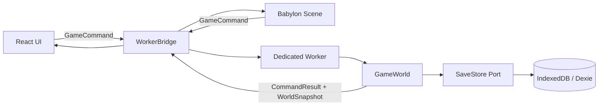

# 第一垂直切片：结构设计

> 输入：[acceptance.md](./acceptance.md)
> 状态：验收闸门已于 2026-07-10 通过。本文只设计满足 S-01～S-08 的最小结构。

## 1. 边界



### 规则

- `GameWorld` 是建筑和占地的唯一真相源；UI 与 Babylon 不得先行生成权威建筑。
- UI/Babylon 只发送命令并渲染确认后的 `WorldSnapshot`。
- Worker 只做传输适配，不包含建造业务规则。
- persistence 只接收经过 schema 校验的快照；损坏存档隔离为 quarantine 记录。
- 所有 package 通过公开接口协作，不导入对方内部文件。

## 2. Packages

| Package | 职责 | 不负责 |
| --- | --- | --- |
| `@empire/protocol` | command/result/snapshot 类型、运行时校验、稳定 reason code | 世界规则、DOM、Babylon、IndexedDB |
| `@empire/simulation` | 地图边界、占地、实体 ID、建造幂等、snapshot/checksum | UI、渲染、浏览器存储 |
| `@empire/persistence` | Dexie 存档、版本校验、隔离损坏记录 | 修改世界规则 |
| `@empire/renderer` | Babylon scene、地面、相机、拾取、预览、snapshot → mesh | 决定建造是否合法 |
| `apps/game-web` | React shell、WorkerBridge、状态文案、自动保存、E2E 入口 | 复制一套模拟状态 |

## 3. 最小接口

```ts
type GameCommand =
  { seq: number; type: 'build'; buildingTypeId: 'house'; x: number; y: number; rotation: 0 | 1 | 2 | 3 };

type BuildRejectionReason =
  | 'invalid-command'
  | 'unknown-building-type'
  | 'out-of-bounds'
  | 'occupied';

type CommandResult =
  | { seq: number; accepted: true; appliedAtTick: number }
  | { seq: number; accepted: false; reason: BuildRejectionReason };

interface WorldSnapshotV1 {
  map: { width: 32; height: 32 };
  tick: number;
  revision: number;
  buildings: Array<{
    id: number;
    typeId: 'house';
    x: number;
    y: number;
    rotation: 0 | 1 | 2 | 3;
  }>;
}

interface SaveEnvelopeV1 {
  saveFormatVersion: 1;
  world: WorldSnapshotV1;
}
```

Worker 消息只有四类：`initialize`、`command`、`ready`、`command-result`；`command-result` 同时携带最新 snapshot。第一切片状态很小，无需增量二进制协议，后续通过性能证据再升级。

## 4. 建造规则

- `house` footprint 固定 2×2。
- 建造命令必须是有限整数；rotation 仅允许 `0|1|2|3`。
- 先验证参数和建筑类型，再验证所有 footprint tile 位于地图内，最后检查占用。
- 只有全部通过才分配 entity ID 并一次性写入占用；拒绝时 snapshot/checksum 不改变。
- 双击会形成两个不同 seq 的命令：第一条成功后，第二条基于更新后的世界被 `occupied` 拒绝，因此最终只有一栋建筑。

## 5. 存档策略

- 数据库包含 `saves` 与 `quarantine` 两张表。
- 自动保存 key 固定为 `autosave`；仅在成功 command 后写入。
- 加载时用 protocol schema 校验；成功则恢复，失败则把原始值及原因写入 quarantine，再返回全新世界。
- 保存采用单事务 `put`；UI 依次显示“保存中”→“已保存”。
- occupancy 和 next entity ID 不进入存档；hydrate 时从建筑列表重建和推导。
- 本轮没有云同步、多个存档槽和迁移链；只接受 v1，未知版本进入隔离。

## 6. 3D 表现

- 视觉方向是“营造司测绘台”：城市地盘本身占据绝对主画面，UI 像贴在测绘台边缘的漆木尺与数据牌，而不是通用科幻 HUD。
- 色彩 token：油烟墨 `#071214`、瓦青 `#163032`、松花绿 `#667f58`、木褐 `#7c4024`、纸本 `#eee2bf`、旧铜 `#b89a55`。旧铜只用于边界和当前选择，避免落入泛用“黑金界面”。
- 字体角色：宋体用于地名与建筑字标；黑体用于操作文案；等宽字体仅用于 tick、坐标和渲染后端。
- 布局签名是底部“营造尺”：反馈、保存、方位、tile 和合法性沿同一条刻度排列，玩家可同时看见操作与测绘结果。
- 自审结论：初稿的深色加金色容易成为模板化黑金风；因此主体改以瓦青/松花绿组织，旧铜退为少量功能强调，唯一大胆元素留给贯穿底部的营造尺。
- 32×32 地图用单个绿色 ground mesh 加网格材质/线框表现；逻辑 tile 大小 4 世界单位。
- `ArcRotateCamera` 使用正交模式，限制俯仰和缩放；Q/E 每次绕目标旋转 90°。
- ground picking 取得世界 X/Z 后转换为 `floor(world/cellSize + halfMap)` 的 tile 坐标。
- 预览为 2×2 半透明 box，合法绿色、非法红色；合法性可先由本地只读 snapshot 快速推断，最终仍以 Worker 结果为准。
- 权威 snapshot 每次到达后按 entity ID 对 mesh 做增删同步。
- HUD 是用户可见 DOM：ready、建筑数、tick、save 状态、renderer 名称、最近反馈；E2E 断言这些可观察结果。

## 7. 测试顺序

### ATDD 外循环

先创建 `first-vertical-slice.spec.ts` 并确认至少 S-01/S-02 在没有应用时失败。

### TDD 内循环

1. protocol：合法/非法 build command 和 snapshot 校验。
2. simulation：合法 2×2 建造。
3. simulation：重叠拒绝且世界不变。
4. simulation：四条边界与负坐标拒绝。
5. simulation：连续重复命令最多一栋。
6. persistence：v1 存取、损坏数据隔离。
7. worker integration：command → result + snapshot。
8. renderer/app：ready、相机、预览、建造反馈、自动保存和恢复。
9. E2E：S-01～S-08。

每项执行红→验红→最小绿→验绿→重构。测试断言结果，不断言内部函数调用次数。

## 8. YAGNI

本轮不引入通用 ECS、Redux、Rust/WASM、SharedArrayBuffer、服务端、物理引擎、完整地形编辑、真实角色动画、经济资源、撤销栈或插件系统。出现真实需求或性能证据后再扩展。
